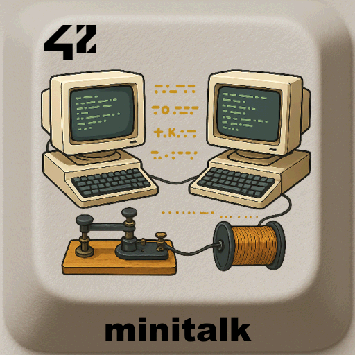

<div align="center">
  <h2>minitalk - 42 project</h2>
  
  <br>
</div>


> A small data exchange program using **UNIX signals**.  
> The goal is to implement a client/server application where messages are transmitted **bit by bit** via `SIGUSR1` and `SIGUSR2`.

---

## 📖 Table of Contents
- [Description](#-description)
- [Features](#-features)
- [Installation](#%EF%B8%8F-installation)
- [Usage](#-usage)
- [Project Structure](#-project-structure)
- [Examples](#-examples)
- [Roadmap](#-roadmap)
- [Credits](#-credits)
- [License](#-license)

---

## 📝 Description
The **minitalk** project consists in creating:
- A **server** program that waits for signals and rebuilds characters bit by bit.
- A **client** program that sends messages (strings) to the server using `SIGUSR1` and `SIGUSR2`.

This project teaches:
- UNIX signals (`kill`, `signal`, `sigaction`, …)
- Bit manipulation
- Inter-process communication (IPC)

---

## ✨ Features
- Transmit a string from client to server using only **signals**.
- Server prints the received string in real time.
- Handles multiple characters and entire messages.
- Bonus: handle **Unicode characters** and **acknowledgement** from server to client.

---

## ⚙️ Installation
Requirements:  
- OS: Linux or macOS  
- C compiler (gcc, clang)  
- `make`

```bash
git clone https://github.com/LogUmi/minitalk.git
cd minitalk
make
```

This will generate two executables:

```
server
client
```

---

## 🖥 Usage
Start the server first:

```bash
./server
# Output: "Server PID: 12345"
```

Then run the client with the server PID and a message:

```bash
./client 12345 "Hello World!"
```

The server will print:

```
Hello World!
``` 

---

## 📂 Project Structure

```
.
├── img/                # Content for README
├── includes/           # Header files (.h)
├── libft/				      # Authorized functions
├── srcs/               # Source code (.c)
├── Makefile
└── README.md
```

---

## 🔎 Examples
Basic message:

```bash
$ ./server
Serveur PID: 17075

Waiting signal ...
```
with another terminal you to use the PID announced:
```bash
$ ./client 17075 "42 Perpignan"
```

Now client and server are exchanging (quite fast with small strings).

Global server output:
```bash
Synchronisation with client PID 17163
Receiving lengh of chain ...
Receiving 13 character(s) ...
receiving checksum ...
Data integrity: Ok
End of synchronisation
42 Perpignan
Waiting signal ...
```

global client output:
```bash
Syncronisation with server PID 17075 : Ok
Sending lengh of chain 12 + 1: Ok
Sending chain: Ok
Sending checksum 126: Ok
Transmission conformity: Ok
End of synchronisation
$ 
```
> ⚠️ Server must be ended by Ctrl+C.

---

## 🚀 Roadmap
This project is the original version that was evaluated at 42 and will remain in this state.  

---

## 👤 Credits
Project developed by **Loïc Gérard** – 📧 Contact: lgerard@studend.42perpignan.fr - [École 42 Perpignan](https://42perpignan.fr).

---

## 📜 License
This project is licensed under the MIT License. You are free to use, modify, and distribute it.

> ⚠️ **Note for students**  
> If you are a student at 42 (or elsewhere), it is strongly recommended **not to copy/paste** this code.  
> Instead, try to **write your own solution** — it’s the only way to really learn and succeed.
